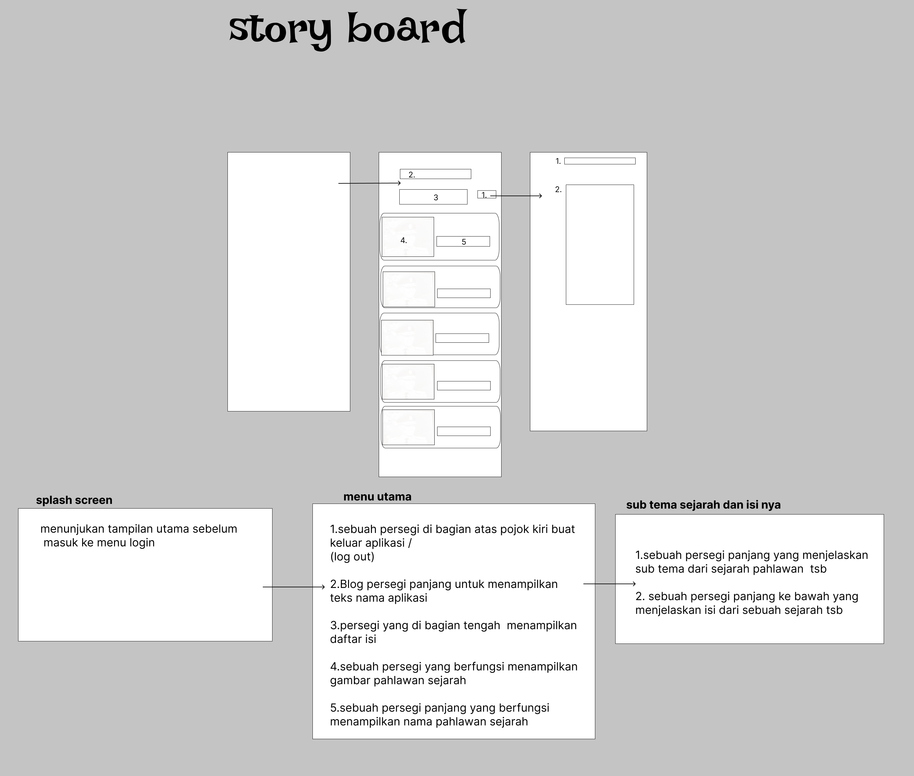
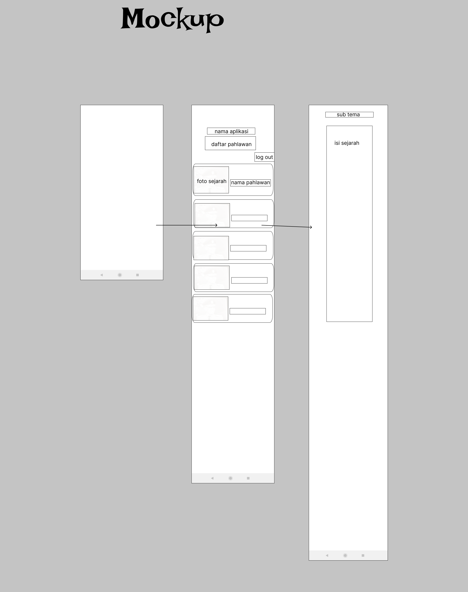
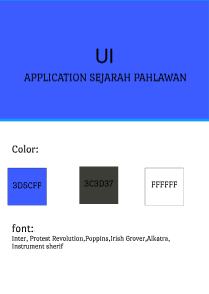
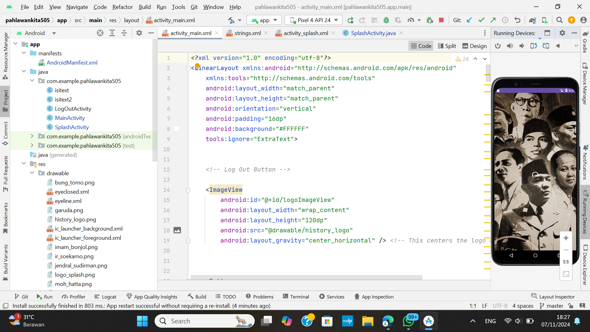
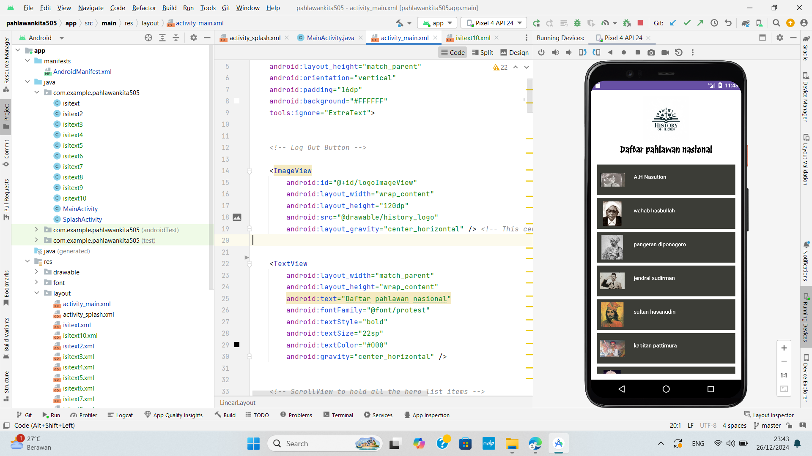
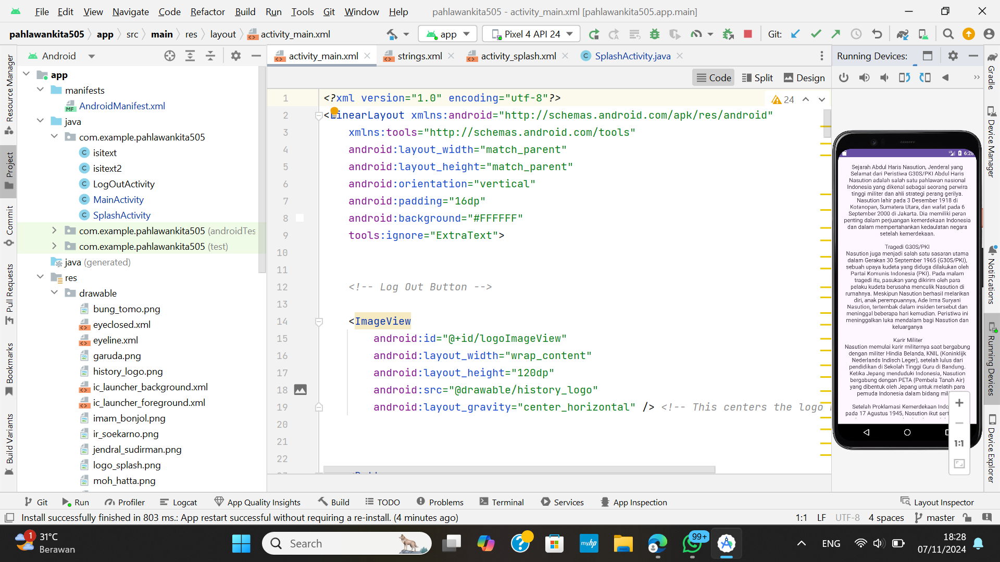

# Aplikasi "Pahlawan Kita" 
## Informasi Mahasiswa
| UTS  |  Pemrograman Mobile 1  
|-------|---------
| NIM   | 312310632
| Nama  | FAKHRI AFIF
| Kelas | TI.23.A6

## 🚀 Teknologi yang Digunakan

- **Frontend**: XML
- **Backend**: Java
- **Database**: -
- **Tools**: Git, GitHub, Android Studio

## Storyboard
  

  ## Mockup
 

## color & Font
 

  ## UI
 
  ### Eksekusi Android Studio

- Splash Screen

- Halaman Utama

- Halaman Tambah Data

## 🎯 Fitur Utama
Aplikasi "Pahlawan Kita"  berfokus pada mengenalkan dan menghormati pahlawan-pahlawan nasional yang telah berjasa bagi bangsa, Berikut adalah penjelasan fitur-fitur pada gambar desain aplikasi "Pahlawan kita" :

- **1.Layar Pembuka (Splash Screen):**
Ini adalah layar awal yang muncul saat aplikasi dibuka. Menampilkan gambar tokoh-tokoh sejarah, menciptakan tema yang berpusat pada gerakan kemerdekaan Indonesia atau pahlawan nasional terkenal.

- **2.Menu Utama:**
Layar ini berjudul "DAFTAR PAHLAWAN", menampilkan daftar pahlawan sejarah dengan gambar kecil dari setiap tokoh, disertai dengan nama mereka.
Ada tombol "Log Out" di bagian atas, memungkinkan pengguna untuk keluar dari akun mereka.
Setiap pahlawan direpresentasikan dengan gambar dan teks, yang tampaknya berfungsi sebagai tautan yang bisa diklik untuk melihat informasi lebih mendetail tentang setiap tokoh.

- **3.Detail Pahlawan (example Sejarah Abdul Haris N...):**
Bagian ini menyediakan biografi atau sejarah terperinci tentang pahlawan yang dipilih.
Konten terdiri dari teks yang mendeskripsikan kehidupan pahlawan, pencapaian, konteks sejarah, dan informasi relevan lainnya.
Ada scrollbar di samping, menunjukkan bahwa pengguna dapat menggulir ke bawah untuk membaca seluruh cerita.

